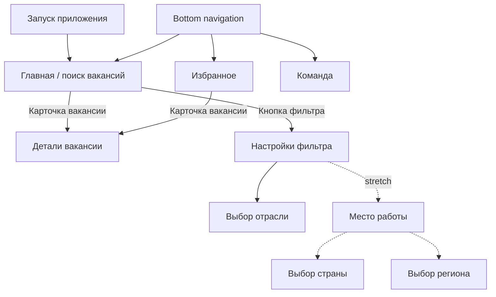

# Продукт и требования

## 1. Назначение

Приложение помогает пользователю найти вакансию, уточнить поиск фильтрами, изучить полное описание и сохранить интересующие вакансии для просмотра без сети.

## 2. Границы релиза

### MVP для команды из трёх человек

- поиск вакансий по непустому тексту;
- отложенный запрос через 2000 мс после последнего ввода;
- постраничная выдача по 20 вакансий;
- фильтры по отрасли, минимальной зарплате и наличию зарплаты;
- просмотр деталей вакансии;
- share, email и телефон из деталей;
- добавление и удаление из избранного;
- список и детали избранных вакансий без сети;
- статический экран команды из трёх участников;
- светлая и тёмная темы.

### Stretch goal

Фильтр «Место работы» со страной и регионом. Для команды из трёх человек он не входит в критический путь приёмки. Его нельзя начинать до завершения обязательного MVP.

### Не входит в объём

- собственный backend или изменение предоставленного API;
- регистрация и профиль пользователя;
- отклик на вакансию внутри приложения;
- история поисковых запросов;
- фоновая синхронизация и кэширование всей поисковой выдачи;
- планшетная/landscape-компоновка;
- локальная пагинация избранного — допустимое, но необязательное улучшение.

## 3. Навигация

Нижняя навигация видна только на корневых экранах «Главная» (фича поиска), «Избранное», «Команда». Детали и все экраны фильтров открываются поверх неё.

## 4. Функциональные требования

### 4.1. Поиск

1. Экран поиска на вкладке «Главная» открывается при запуске.
2. До первого поиска показывается начальный плейсхолдер.
3. Пустая строка не запускает запрос.
4. Для непустой строки запрос запускается, если пользователь не менял текст 2000 мс.
5. Новый ввод отменяет или делает неактуальным предыдущий запрос; устаревший ответ не должен заменить свежий.
6. При непустом поле видна кнопка очистки; она очищает текст и возвращает начальное состояние.
7. Успешный ответ показывает общее число найденных вакансий и список карточек.
8. Карточка содержит доступные название, компанию, город, зарплату и логотип.
9. Для отсутствующего, загружающегося или ошибочного логотипа показывается плейсхолдер.
10. Зарплата форматируется как `от XX`, `до XX`, `от XX до XX` либо `зарплата не указана`.
11. Числа зарплаты разделяются на разряды неразрывными пробелами; валюта берётся из ответа.
12. Поддерживаются `RUR/RUB`, `BYR`, `USD`, `EUR`, `KZT`, `UAH`, `AZN`, `UZS`, `GEL`, `KGT`.
13. Пустой результат, отсутствие сети и серверная ошибка имеют отдельные состояния.
14. Нажатие на карточку открывает детали по `id`.

#### Пагинация

- Первая страница заменяет предыдущую выдачу; следующая добавляется к текущей.
- Следующая страница запрашивается у конца списка, если текущая страница не последняя.
- Одна успешно полученная страница не запрашивается повторно.
- Элементы с одинаковым `id` не дублируются.
- Во время дозагрузки показывается нижний индикатор, не блокирующий список.
- Ошибка дозагрузки сохраняет уже показанные вакансии, скрывает индикатор и показывает Toast «Проверьте подключение к интернету» либо «Произошла ошибка».

### 4.2. Фильтры MVP

Параметры необязательны и передаются в API только при наличии значения:

- выбранная отрасль;
- целочисленная минимальная зарплата;
- флаг «Не показывать без зарплаты».

Поведение:

1. Любое изменение автоматически сохраняется и переживает перезапуск.
2. «Сбросить» видна при наличии хотя бы одного параметра и очищает все параметры.
3. «Применить» видна при наличии хотя бы одного параметра, возвращает на поиск и повторяет непустой последний запрос.
4. Системная кнопка «Назад» возвращает на поиск без автоматического повторения запроса, но уже изменённые параметры остаются сохранёнными.
5. При непустых сохранённых фильтрах иконка фильтра на поиске подсвечена.
6. Поле зарплаты принимает только целые числа и имеет кнопку очистки.

#### Выбор отрасли

- Список загружается из `/industries` и показывается плоско.
- При ошибке показывается отдельный плейсхолдер.
- Локальный поиск оставляет элементы, содержащие введённый текст без учёта регистра.
- Выбор одиночный.
- «Выбрать» видна только при выбранной отрасли.
- Выбранная отрасль восстанавливается при повторном открытии.

### 4.3. Детали вакансии

1. Экран открывается из поиска и избранного; нижняя навигация скрыта.
2. Есть состояния загрузки, контента, отсутствия сети и ошибки.
3. Контент прокручивается.
4. Показываются только доступные поля: название, зарплата, работодатель, логотип, адрес или регион, опыт, график, занятость, описание, навыки и контакты.
5. Отсутствие любого опционального поля не приводит к сбою и не оставляет пустой заголовок раздела.
6. HTML-описание отображается форматированно, а не как исходные теги.
7. Если адрес отсутствует, используется название региона.
8. «Поделиться» отправляет системным chooser ссылку из поля `url`.
9. Email открывает chooser для `mailto:`, телефон — для `tel:`; комментарий к телефону отображается рядом.
10. Кнопка избранного отражает актуальное состояние и переключает его без задержки интерфейса.
11. Сохранённая вакансия открывается без сети из Room; логотип может быть заменён плейсхолдером.
12. HTTP 404 показывает ошибку и удаляет устаревшие сохранённые детали этой вакансии из Room.

### 4.4. Избранное

1. В Room сохраняются данные, достаточные для полного офлайн-экрана деталей, а не только карточка.
2. Добавление и удаление немедленно обновляют список и состояние кнопки деталей.
3. Есть состояния пустого списка, списка и ошибки чтения.
4. Карточка и формат зарплаты совпадают с поиском.
5. Список и детали доступны без сети; для логотипа допустим плейсхолдер.
6. Нажатие на карточку открывает детали по `id`.

### 4.5. Команда

- Экран открывается из нижней навигации.
- Показывает статический список трёх участников проекта и их роли.
- ViewModel не требуется.

### 4.6. Место работы — stretch

- Список областей загружается из `/areas`.
- Страна определяется по отсутствующему `parentId`; DTO должен допускать `null`.
- При выбранной стране показываются только её регионы; без страны — все элементы, не являющиеся странами.
- Поиск региона локальный и регистронезависимый.
- Выбор региона автоматически выбирает родительскую страну.
- Выбранные значения сохраняются и передаются в `area` поискового запроса.

## 5. Нефункциональные требования

| Категория | Требование |
|---|---|
| Платформа | Android 8.0+, `minSdk = 26`; только `portrait`. |
| Архитектура | Single Activity, Navigation Component, BottomNavigationView, Clean Architecture, MVVM. |
| UI | XML NavHost/BottomNavigationView в SingleActivity; содержимое экранов через ComposeView и Composable; точное соответствие Figma в light/dark MaterialTheme. |
| Асинхронность | Coroutines; сетевые и дисковые операции вне main thread. |
| Сеть | Retrofit/OkHttp, единая авторизация, предварительная проверка доступности сети и явное преобразование ошибок. |
| Хранение | Room для избранного, SharedPreferences для фильтров. |
| DI | Koin, модули разделены по ответственности. |
| Ресурсы | Пользовательские строки, цвета, размеры и отступы вынесены в `res/values`. |
| Качество | Проект собирается, detekt проходит, критические замечания исправлены, после merge нет деградации. |
| Безопасность | API-токен отсутствует в Git, логах, скриншотах и документации. |

## 6. Состояния экранов

| Экран | Состояния |
|---|---|
| Поиск | initial, loading-first-page, content, empty, no-network, server-error, loading-next-page, next-page-error. |
| Фильтр | empty, partially-filled, filled; сохранённое и временно показанное состояние совпадают после каждого изменения. |
| Отрасли | loading, content, locally-filtered, no-local-results, error, selected. |
| Детали | loading, content, no-network, error/404, offline-favorite. |
| Избранное | loading/read, content, empty, database-error. |
| Команда | static-content. |

## 7. Общий критерий приёмки

Фича принята, если реализован её сквозной сценарий, обработаны перечисленные состояния, UI проверен в обеих темах, DTO не покидают Data-слой, тесты соответствующего уровня проходят, сборка и detekt зелёные, а PR прошёл взаимное ревью.
