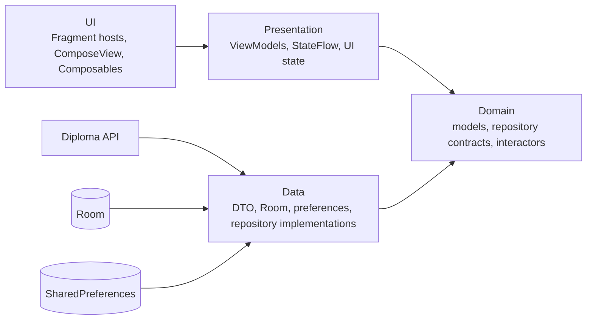

# Архитектура

## 1. Базовый подход

Для учебной приёмки используется гибридная UI-схема, требуемая заданием:

- Kotlin;
- Single Activity и Jetpack Navigation Component с Fragment destinations;
- XML layout только для контейнера `NavHostFragment` и `BottomNavigationView`;
- каждый Fragment размещает `ComposeView`, а всё содержимое экрана реализуется Composable-функциями;
- Compose `MaterialTheme` со светлой и тёмной цветовыми схемами;
- MVVM: Composable/Fragment-host → ViewModel → Interactor → Repository;
- `StateFlow` для состояния будущих feature-экранов;
- Coroutines для асинхронной работы;
- Retrofit/OkHttp, Room, SharedPreferences, Glide, Koin.

`BottomNavigationView` и Navigation Component остаются View-based каркасом SingleActivity. Поля ввода, списки, карточки, состояния и прочие элементы из Figma (кроме самой нижней панели) создаются внутри `ComposeView`. Отдельные XML-layout экраны, ViewBinding и XML-адаптеры для их содержимого не используются.

## 2. Слои и зависимости



Правило зависимостей: Domain не знает об Android, Retrofit, Room, DTO и View. UI не обращается напрямую к Data.

## 3. Рекомендуемая структура

Один модуль `app` достаточен для дипломного объёма. Пакеты разделяются по слоям, а внутри Presentation/UI — по фичам:

```text
app/src/main/java/<package>/
├── App.kt
├── di/
│   ├── dataModule.kt
│   ├── domainModule.kt
│   └── presentationModule.kt
├── data/
│   ├── db/
│   │   ├── AppDatabase.kt
│   │   ├── VacancyDao.kt
│   │   └── VacancyEntity.kt
│   ├── dto/
│   ├── mapper/
│   ├── network/
│   │   ├── DiplomaApi.kt
│   │   ├── RetrofitFactory.kt
│   │   └── AuthInterceptor.kt
│   ├── preferences/
│   └── repository/
├── domain/
│   ├── model/
│   ├── repository/
│   └── interactor/
├── presentation/
│   ├── search/
│   ├── vacancy/
│   ├── favorites/
│   ├── filter/
│   └── team/
├── ui/
│   ├── common/
│   ├── theme/
│   ├── search/
│   ├── vacancy/
│   ├── favorites/
│   ├── filter/
│   └── team/
└── util/
```

Название корневого package утверждается до начала разработки и не меняется в середине итерации.

## 4. Основные доменные модели

| Модель | Назначение | Важные поля |
|---|---|---|
| `VacancyCard` | Элемент поиска и избранного | `id`, `name`, `company?`, `city?`, `salary?`, `logo?`. |
| `VacancyDetails` | Полный экран и офлайн-хранение | Поля актуального detail API; опциональность сохраняется. |
| `Salary` | Единое форматирование | `from?`, `to?`, `currency?`. |
| `Industry` | Выбор отрасли | `id`, `name`. |
| `Area` | География, stretch | `id`, `name`, `parentId?`, `areas`. |
| `FilterSettings` | Сохранённые фильтры | `industry?`, `salary?`, `onlyWithSalary`; позднее `area?`. |
| `PageInfo` | Пагинация | `currentPage`, `totalPages`, `loadedIds`. |

DTO преобразуются в эти модели внутри Data. Entity Room преобразуется отдельно и не используется как UI-модель.

## 5. Контракты репозиториев

Минимальный набор:

```kotlin
interface VacancyRepository {
    suspend fun search(query: String, filters: FilterSettings, page: Int): SearchResult
    suspend fun getDetails(id: String): VacancyDetails
}

interface FavoritesRepository {
    fun observeFavorites(): Flow<List<VacancyDetails>>
    suspend fun getFavorite(id: String): VacancyDetails?
    suspend fun add(vacancy: VacancyDetails)
    suspend fun remove(id: String)
    fun observeIsFavorite(id: String): Flow<Boolean>
}

interface FilterRepository {
    fun get(): FilterSettings
    fun save(settings: FilterSettings)
    fun clear()
}

interface CatalogRepository {
    suspend fun getIndustries(): List<Industry>
    suspend fun getAreas(): List<Area>
}
```

Сигнатуры являются ориентиром. Команда может выбрать `Result`, собственный `Resource` или типизированные исключения, но способ должен быть единым во всех фичах.

## 6. UI state и одноразовые события

Каждый ViewModel публикует один согласованный state вместо набора несвязанных boolean-флагов. Пример для поиска:

```kotlin
sealed interface SearchUiState {
    data object Initial : SearchUiState
    data object Loading : SearchUiState
    data class Content(
        val items: List<VacancyCard>,
        val found: Int,
        val isLoadingNextPage: Boolean
    ) : SearchUiState
    data object Empty : SearchUiState
    data object NoInternet : SearchUiState
    data object Error : SearchUiState
}
```

Composable собирает state из `StateFlow` с учётом lifecycle хоста. Toast, навигация и запуск системного chooser — одноразовые события. Они не должны повторяться после пересоздания Fragment или recomposition. Конкретный механизм (`Channel`/`SharedFlow` и т.п.) фиксируется в Epic 0 и используется одинаково.

## 7. Поиск и конкурентность

- Debounce: 2000 мс.
- Каждый новый текст создаёт новый search generation и отменяет предыдущую job.
- Ответ применяется только к той generation, для которой он был отправлен.
- Новый запрос или применение фильтров сбрасывает `page`, `pages`, список и множество `loadedIds`.
- Дозагрузка блокируется, пока уже идёт запрос, страница загружена либо достигнута последняя страница.
- При ошибке следующей страницы контент остаётся доступным; повторная попытка возможна после нового достижения конца списка.

## 8. Источник деталей и офлайн-режим

Алгоритм `getDetails(id)`:

1. Если сеть доступна, запросить API.
2. При успехе показать сетевые детали; если вакансия уже в избранном, обновление локальной записи допускается после согласования стратегии.
3. При HTTP 404 удалить запись с этим `id` из Room и вернуть типизированную ошибку.
4. При отсутствии сети или транспортной ошибке проверить Room.
5. Если запись найдена, показать её как offline-favorite; иначе показать соответствующую ошибку.

Room хранит все текстовые данные деталей. Удалённая картинка не гарантируется офлайн, поэтому для логотипа используется плейсхолдер.

## 9. Навигационный контракт

| Переход | Аргумент | Нижняя панель |
|---|---|---|
| Search → Vacancy | `vacancyId: String` | скрыта на destination. |
| Favorites → Vacancy | `vacancyId: String` | скрыта на destination. |
| Search → Filter | нет | скрыта. |
| Filter → Industry | выбранный ID читается из общего хранилища/ViewModel | скрыта. |
| Filter → Search через «Применить» | результат `filtersApplied = true` | видна на Search; непустой запрос повторяется. |
| Back из Filter → Search | обычный back | сохранённые настройки остаются, автоматического запроса нет. |

Safe Args предпочтителен. Общий `nav_graph.xml` изменяет назначенный владелец, чтобы не создавать параллельные конфликты.

## 10. DI

- `dataModule`: Retrofit, OkHttp, API, Room, DAO, SharedPreferences, реализации repository.
- `domainModule`: interactors/use cases.
- `presentationModule`: ViewModel по фичам.
- Singleton только для безопасно разделяемых stateless-компонентов, БД, API и хранилищ.
- Fragment, `ComposeView`, `NavController` и Composable-функции не размещаются в DI.

## 11. Ошибки

Data преобразует технические причины в небольшой набор доменных ошибок:

```text
NoInternet | Unauthorized | NotFound | Server | Database | Unknown
```

HTTP-коды не должны анализироваться во Fragment или Composable. Текст ошибки выбирает UI через строковые ресурсы.

## 12. Секреты и сборка

- Локально токен находится в игнорируемом `develop.properties` как `apiAccessToken=...`.
- Gradle прокидывает его в `BuildConfig`; interceptor формирует `Authorization: Bearer <token>`, значение не печатается.
- Обычный GitHub Actions build использует пустой токен, чтобы реальное значение нельзя было извлечь из загружаемого APK.
- Если команде понадобится live API smoke, он запускается отдельным защищённым job без публикации APK и логирования заголовков.
- В репозиторий добавляется только `develop.properties.example` без значения.
- В debug-логах сетевой interceptor обязан редактировать заголовок `Authorization`.

## 13. Минимальная тестируемость

- ViewModel и interactors получают dispatchers/абстракции через DI или конструктор.
- Composable получает неизменяемый UI state и callbacks; Data/Domain зависимости в UI не передаются.
- Retrofit, DAO и preferences скрыты интерфейсами repository.
- Форматирование зарплаты — чистая функция с unit-тестами.
- Мапперы DTO/Entity — чистые функции с тестами на null и неполные ответы.
- Для пагинации тестируются конкурентные запросы, дедупликация и ошибки следующей страницы.
